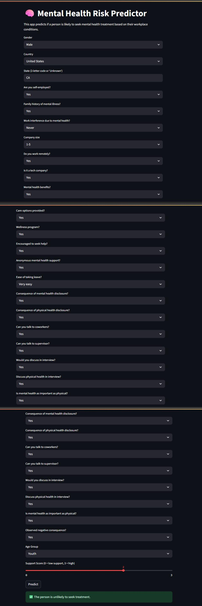

 🧠 Mental Health Risk Predictor:

A machine learning web app built with Streamlit to predict whether a person is likely to seek mental health treatment based on workplace and demographic factors.

 📌 Features:

- ✅ Predicts risk of mental health treatment using a Logistic Regression model  
- 🎯 Interactive and user-friendly Streamlit web interface  
- 📊 Uses real-world survey data  
- 🧹 Handles missing values and categorical data  
- 🚀 Ready for deployment  

 📂 Dataset:

Survey data from tech employees about mental health in the workplace.  
Preprocessed to:

- Clean `Gender` column  
- Group less frequent `Country` and `State` entries  
- Encode binary/categorical features  
- Add `age_group` and `support_score` for better prediction  

---

 🚀 How to Run:

1. Clone the repo:
   
   git clone https://github.com/Digant-Vaishnav/mental-health-predictor.git
cd mental-health-predictor

2. Install dependencies:

    pip install -r requirements.txt

3. Run the app:
    
    streamlit run mental_health_app.py

🧠 Model Info:

-  Model: Logistic Regression
-  Accuracy: ~74%
-  Evaluation: GridSearchCV, Cross-validation
-  Features Used: 26 features including workplace support, anonymity, company size, family history, and more

🔍 Model Comparison:

| Model                   | Accuracy | F1 Score (Balanced) | Notes                                            |
| ----------------------- | -------- | ------------------- | ------------------------------------------------ |
| **Logistic Regression** | \~74%    | Good                | Best balance of interpretability and performance |
| Random Forest           | \~71%    | Slightly lower      | Higher complexity, risk of overfitting           |
| SGD Classifier          | \~72%    | Moderate            | Faster training, but less stable                 |

                   📌 Logistic Regression was selected due to its reliable performance and simplicity for deployment.

📌 Folder Structure:

       mental-health-predictor/
│
├── mental_health_app.py         # Streamlit app
├── mental_health_model.pkl      # Trained model
├── requirements.txt             # Dependencies
├── README.md                    # This file
└── screenshot.png               # App screenshot (optional)

📬 Author:

- Name:     Digant Vaishnav
- LinkedIn: [https://www.linkedin.com/in/digant-vaishnav-8021a9326]
- GitHub:   Digant-Vaishnav

📸 Screenshot:

- 
